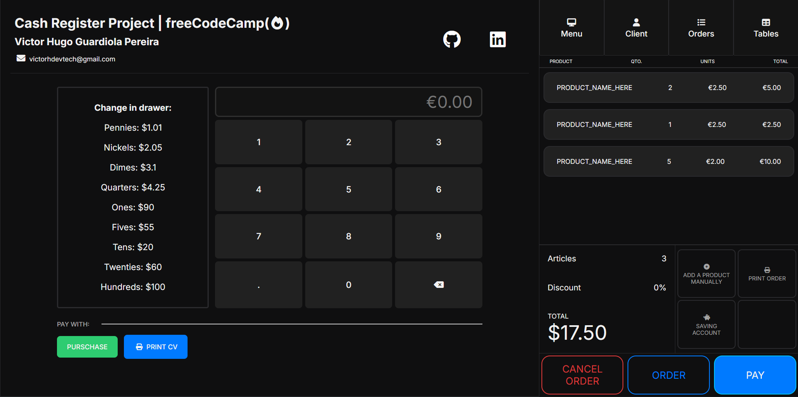

# 💰 Cash Register Project  
_A modern Point of Sale (POS) interface built with HTML, CSS, and JavaScript._



## 🧩 Overview
This project was developed as part of the **freeCodeCamp JavaScript Algorithms and Data Structures certification**.  
It simulates a **cash register system** that calculates the correct change due to the customer, based on the purchase amount and the cash received.  

Unlike the base example provided by freeCodeCamp, this version has been **redesigned from scratch** to feel like a **real, modern POS system**, focusing on **UI design, responsiveness**, and **code structure clarity**.

---

## 🚀 Features
- 🧮 Calculates and displays change dynamically based on user input.  
- 💵 Manages multiple denominations (from pennies to hundreds).  
- 🔁 Updates the cash drawer in real-time after every transaction.  
- ⚠️ Handles special cases:
  - Insufficient funds
  - Exact payment
  - Drawer closed scenario  
- ⌨️ Interactive numeric keypad for entering amounts.  
- 🖥️ Fully responsive and mobile-friendly layout.  
- 🎨 Minimalist **dark theme** with smooth transitions and modern typography.  

---

## 🛠️ Tech Stack
| Area | Technologies |
|------|---------------|
| **Structure** | HTML5 |
| **Styling** | CSS3 (Flexbox, Grid, Variables, Animations) |
| **Logic** | Vanilla JavaScript (ES6+), DOM Manipulation |
| **Icons** | Font Awesome |
| **Design** | Custom Dark UI with Responsive Layout |

---

## ⚙️ How It Works
1. The user enters a payment amount manually or using the keypad.  
2. When the **"Purchase"** button is pressed, the script:
   - Compares the amount received with the total price.
   - Calculates how much change is due.
   - Determines which denominations should be returned.
   - Updates the UI accordingly.  
3. The app also updates the drawer display, simulating the cash register’s balance in real-time.  

---

## 📁 Project Structure
```bash
Cash-Register-Project/
│
├── index.html # Main structure and layout
├── styles.css # Styles and responsive design
├── script.js # Core logic of the cash register
└── README.md # Project documentation

---

## 🧠 Key Learning Takeaways
Building this project helped reinforce:
- DOM manipulation and event-driven logic in JavaScript.  
- Problem-solving with arrays and objects.  
- Use of floating-point precision handling in currency calculations.  
- Creating responsive and accessible UI components.  
- Writing clean, readable, and maintainable front-end code.  

---

## 💡 Future Improvements
- 🧾 Add a simulated **receipt printout** feature.  
- 💾 Implement **localStorage** to persist drawer state between sessions.  
- 🌍 Add **multi-currency** support (€ / $ / £).  
- ♿ Improve **accessibility** (ARIA labels, keyboard navigation).  

---

## 👨‍💻 Author
**Victor Hugo Guardiola Pereira**  

[](https://github.com/HelixGuardi)  
[](https://www.linkedin.com/in/victorhugo-dev/)  

---

## 🏁 About This Project
This project is part of my personal mission to transform every **freeCodeCamp** challenge into a **real-world portfolio piece** — turning learning experiences into visually polished and technically solid applications.  
It’s not just a coding exercise — it’s a reflection of my process as a **Full-Stack Web Developer** combining logic, usability, and design.

---
